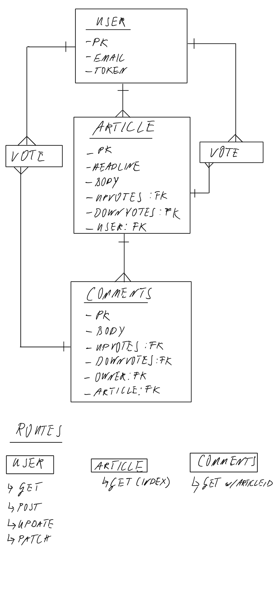

# ExTABER

## Introduction
ExTABER is a platform where independent investigative journalists can publish their work, create a readership, and 
potentially monetise their work. The ethos underlying ExTABER is hidden in form of an anagram in its name. The 
anagram is based on the epistemological viewpoint that free thought must exist **Ex** Tradition, **A**authority, 
**E**established **B**relief, and **R**evelation.

## Link to Repositories & Deployed Sites
### Front-End
The repo can be found on [GitHub](https://github.com/sven-gerlach/extaber-client) whilst the deployed APP is hosted 
on [GitHub Pages](https://sven-gerlach.github.io/extaber-client/#/)

### Back-End
The repo can be found on [GitHub](https://github.com/sven-gerlach/extaber-api) whilst the deployed back-end is hosted 
on [Heroku](https://extaber-api.herokuapp.com/)

## ERD
This back-end is entirely based on django, django rest framework, and PostgreSQL. It features many-to-many relationships, 
5 models, and 19 views.

## Resource Summary

### User Views

Verb | URI | Body | Headers | Status Response | Response Body
--- | --- | --- | --- | --- | --- |
POST | sign-up/ | Credentials | n/a | 201, Created | user details
POST | /sign-in/ | credentials | token | 201, Created | token
PATCH| /change-pw/| credentials | token | 204, No Content | n/a
DELETE | /sign-out/ | n/a | token | 204, No Content | n/a
PATCH| /update-user-details/ | username / user image url | token | 200, OK | user fields

### Article Views
Verb | URI | Body | Headers | Status Response | Response Body
--- | --- | --- | --- | --- | --- |
GET | articles/ | n/a | n/a | 200, OK | articles 
POST | articles/ | article content | token | 201 | n/a
GET | articles/search/:search_string/ | n/a | token | 200 | articles
GET | my-articles/ | n/a | token | 200 | articles
DELETE | articles/:pk/ | n/a | token | 204 | n/a
PATCH | articles/:pk | article content | token | 204 | n/a
GET | article/:pk | n/a | n/a | 200 | article

### Article Votes Views
Verb | URI | Body | Headers | Status Response | Response Body
--- | --- | --- | --- | --- | --- |
GET | article-votes/ | n/a | n/a | 200 | votes data
POST | article-votes/ | vote data | token | 201 | n/a
GET | article-votes/:pk/ | n/a | token | 200 | net votes
DELETE | article-votes/:pk/ | n/a | token | 204 | n/a

### Comment Views
Verb | URI | Body | Headers | Status Response | Response Body
--- | --- | --- | --- | --- | --- |
GET | comments/:pk/ | n/a | n/a | 201 | comments for article pk
POST | comments/ | comment data | token | 204 | n/a
GET | my-comments/ | n/a | token | 200 | comments made by user
PATCH | my-comments/:pk/ | comment update | token | 204 | n/a
DELETE | my-comments/:pk/ | n/a |token | 204 | n/a

### Comment Votes Views
Verb | URI | Body | Headers | Status Response | Response Body
--- | --- | --- | --- | --- | --- |
GET | comment-votes/ | n/a | n/a | 200 | comment vote data
POST | comment-votes/ | comment vote data | token | 201 | n/a
GET| comment-votes/:pk | n/a | token | 200 | net votes

## List of Technologies
- django
- django rest framework
- PostgreSQL
- Heroku

## Unsolved Problems
-[ ] server-side filtering needs more features, including boolean search, search for authors, time-period filters, etc

## Planning & Process Management

The Kanban for this project can be reviewed on [GitHub Projects](https://github.com/sven-gerlach/extaber-api/projects/1)

